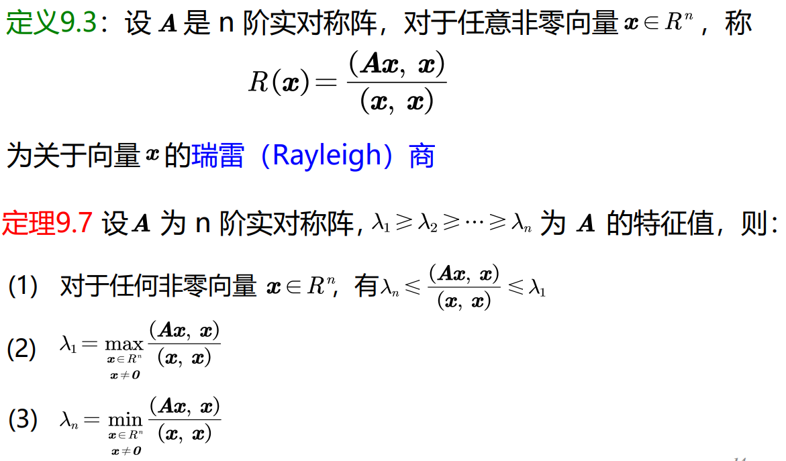
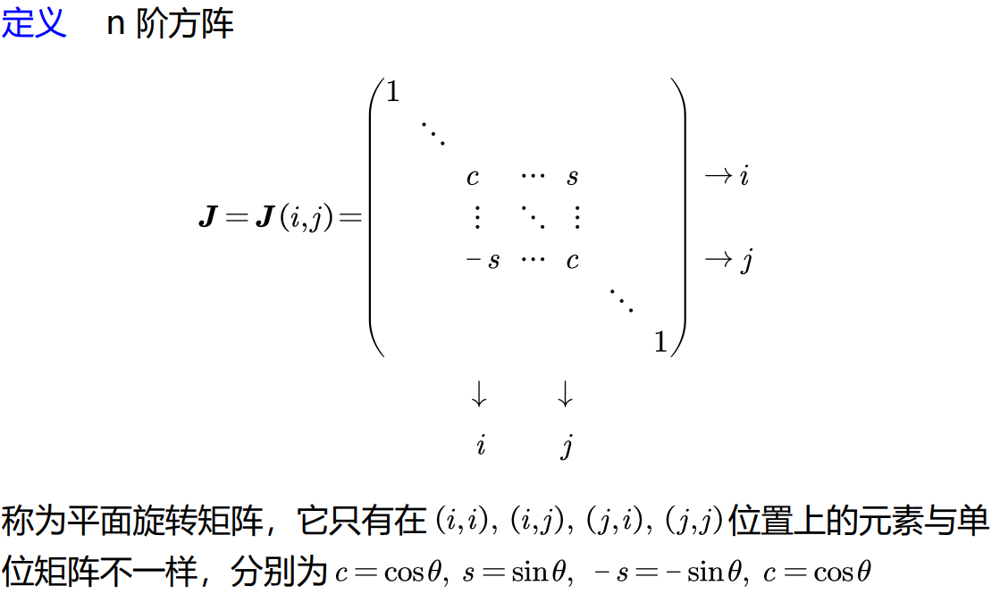
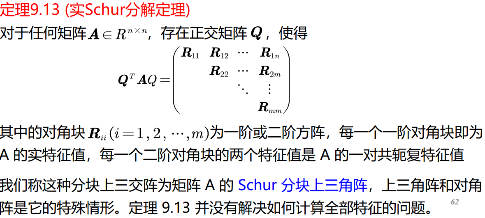
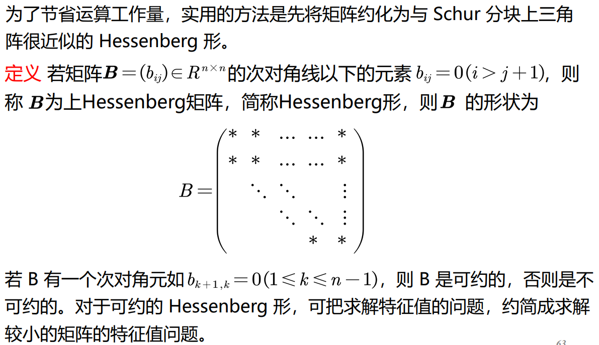

求特征值问题可以转化为方程求根问题，但高次多项式求根精度低，一般不作为求解方法。目前的方法是针对矩阵不同的特点给出不同的有效方法

**如何估计矩阵特征值界?**

**定义** 设 $A = (a_{i,j})_{n \times n}$，令

1. $r_i = \sum_{j=1, j \ne i}^{n} |a_{i,j}| (i = 1, 2, \ldots, n)$；

2. 集合 $D_i = \{ z \mid |z - a_{ii}| \le r_i, z \in \mathbb{C} \}$。称复平面上以 $a_{i,i}$ 为圆心，以 $r_i$ 为半径的所有圆盘为 $A$ 的格什戈林 (gershgorin) 圆盘

**(盖尔圆盘定理)** 设 $A = (a_{ij})_{n \times n}$，则 $A$ 的每一个特征值必属于下述某一个圆盘之中：

$$
| \lambda - a_{i,i} | \le r_i = \sum_{j=1, j \ne i}^{n} |a_{i,j}|, \quad (i = 1, 2, \ldots, n)
$$

或者说 $A$ 的特征值都在复平面上 $n$ 个圆盘的并集中

(第二圆盘定理) 如果$A$的 m 个圆盘组成连通的并集 S 且与余下的 n-m 个圆盘是分离的，即不相交，则 S 内恰包含 m 个 的特征值。

特别地，当 S 是一个圆盘且与其它 n-1 个圆盘是分离的 (即 S 为孤立圆盘)，则 S 中精确包含一个特征值

The above should be transferred to Algebra.

# Power Method

在一些工程与物理问题中，通常只需要求出矩阵的按模最大的特征值（称为主特征值）和相应的特征向量

幂法是一种计算 n 阶实矩阵 的主特征值的一种迭代法

优点

- 方法简单，**对稀疏矩阵较合适**

缺点

- 有时收敛速度很慢

**定理** 设 $A \in \mathbb{R}^{n \times n}$ 有 $n$ 个线性无关的特征向量，主特征值 $\lambda_1$ 满足

$$
|\lambda_1| > |\lambda_2| \ge \cdots \ge |\lambda_n|
$$

则对 $\mathbb{R}^n$ 中的任意一非零向量 $v_0$ ，按下述方法构造向量序列 $\{v_k\}, \{u_k\}$:

$$
\left\{
\begin{aligned}
&\vec v_0 = \vec u_0 \ne \vec 0 \\
&\vec v_k = A \vec u_{k-1} \\
&\mu_k = \max\{\vec v_k\} \quad k = 1, 2, \ldots \\
&\vec u_k = \frac{\vec v_k}{\mu_k}
\end{aligned}
\right.
$$

则有：

$$
\lim_{k \to \infty} \vec u_k = \frac{\vec x_1}{\max\{\vec x_1\}}; \quad \lim_{k \to \infty} \mu_k = \lambda_1
$$

where $x_1$ is the eigenvector corresponding to the eigenvalue $\lambda_1$.

## Acceleration

The speed of convergence is mainly determined by $|\lambda_2/\lambda_1|$.

To make this value smaller, we can introduce $B=A-\lambda I$. They have same eigenvector and eigenvalue only differ by $p$.

As long as you ensure that 

- $\lambda_1-p$ is still the main eigenvalue of $B$;

Further the second main eigenvalue has 2 candidates: $\lambda_2-p$ and $\lambda_n-p$.

So 

$$
r'=\min_p\frac{\max\{|\lambda_2-p|,|\lambda_n-p|\}}{|\lambda_1-p|}.
$$

We know that this is the smallest when $\lambda_2-p=-\lambda_n+p$. So as long as we have approximation of $\lambda_2$ and $\lambda_n$ we can figure out $p$ approximately.

**Inverse power method**

Apply power method to $A^{-1}$ to get the absolutely smallest eigenvalue.

# Jacobi Method

We know that real symmetric matrix can be orthogonally diagonalised. But how can we find the orthogonal matrix?

Jacobi 方法是用来计算实对称矩阵的全部特征值及对应的特征向量的一种变换方法，其根本思想是对矩阵作一系列正交相似变换，使其非对角元素收敛到零，所用的变换是 Jacobi 旋转变换.下面先讨论 Jacobi 旋转变换及其性质

$B:=JAJ^T$. We know that only $i,j$ row and column are changed, in the manner of rotation with $\theta$.

Calculation yields

$$
b_{i,j}=\frac12\sin(2\theta)(a_{j,j}-a_{i,i})+\cos(2\theta)a_{i,j}.
$$

Let $b_{i,j}=0$ we get

$$
\tan 2\theta=\frac{2a_{i,j}}{a_{i,i}-a_{j,j}},|\theta|\le\frac\pi4.
$$

You can verify that after 1 rotation, the **sum of squares of non-diagonal elements** is reduced by $2a_{i,j}^2$, which is added to the **sum of squares of the diagonal elements**.

Do this to eliminate the absolutely biggest non-diagonal element.

Advantage

精度一般都比较高，特别是求得的特征向量正交性很好。

Disadvantage

- 计算量大

- 若原矩阵是稀疏矩阵，旋转变换后不能保持其稀疏的性质。

# QR Method Test?

On complex matrix we can achieve a more satisfactory result: $A$ is strictly upper triangular matrix while $Q$ is unitary matrix

## Mirror Matrix
Also called Householder matrix.

**Definition**

*Supposition*

1. $\vec w\in\R^n,||\vec w||_2=1$.

*Definition*

$$
H(\vec w):=I-2\vec w\vec w^T
$$

is called a mirror matrix, where $\vec w$ is actually the **normal** of the mirror.

**Property**

1,

$H=H^T=H^{-1}.$

2,

$||\vec x||_2=||H\vec x||_2.$

3,

You can always find an $H$ to map a vector to a certain direction, say $(\pm1,0,0,...,0)$. Here we choose direction(sign of $x_1$) to maxify the length of $\vec w$ to improve the stability of the calculation.

**Lemma**

$$
\forall A\in\R^{n\times n}, \exists Q(Q^HQ=I), s.t.\ Q^HAQ\text{ is a Hessberg matrix}.
$$

*Proof*

Construct $n-1$ order mirror matrix $H$. 

Let $P=\text{diag}(1, H)$.

$A_2:=PA_1P^T$ eliminates all elements in the first column under the sub-diagonal.

Then do it iteratively.
