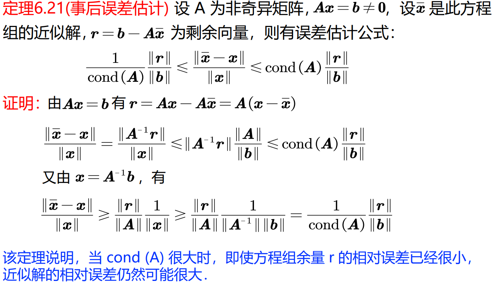

# Gauss

$$
A\vec x=\vec b.
$$

Make $A$ an upper corner matrix by applying one row minus $k$ times another row.

The complexity is $\Omicron(n^3)$.

局限：

- 在消元过程中，我们假定了对角元素$a_{k,k}^{(k)}\neq 0$，由于每次消元时是按未知量的自然顺序进行的，而顺序消元不改变A的主子式的值，因此高斯消元法可行的充要条件为A的各阶主子式不为零。
  实际上只要 $|A|\neq 0$方程组就有解
- 即使高斯消元法可行，如果$a_{k,k}^{(k)}\neq 0$很小，运算中用它作分母会导致其它元素数量级的严重增长和舍入误差的扩散。

## 列主元消去法

先在A的第一列选取绝对值最大的元素作为主元素 swap to row 1 thus try to avoid $a_{k,k}^{(k)}$ has small absolute value.

完全主元素消去法。在其过程的第k步 ，不是按列来选主元，而是在右下角的子阵中选主元

完全主元法比列主元法运算量大得多，由于列主元法的舍入误差一般已较小，所以在实际计算中多用列主元素消去法

### Matrix Representation

设A为非奇异矩阵，则存在排列矩阵P，使得

$$
PA=LU
$$

其中$L$为单位下三角矩阵， $U$为上三角矩阵.

## Gauss-Jordan

after make it an upper matrix, from bottom to top break-brick to make diagonal matrix.

Find inverse

# LU Decomposition

You can use left mulplication to represent row transition.

$$
L_1:=
\left(
\begin{matrix}
1 & 0 & 0\\
\\
-l_{2,1} & 1 & 0\\
\\
-l_{3,1} & 0 & 1\\
\end{matrix}
\right)
$$

So multiply all $L$ together you can get a lower triangle matrix.

So Gauss is essentially this decomposition.

$A$ satisfies the requirement of Gauss so $A=LU$, where $L$ is unit lower corner matrix and $U$ is upper corner matrix.

And further you can make $U=D\tilde U$, where $D$ is diagonal and $\tilde U$ is unit upper corner matrix.

$$
A\vec x=\vec b\iff L(U\vec x)=\vec b\iff U\vec x=L^{-1}\vec b
$$

LU decomposition can be more efficient than Gaussian elimination when solving multiple systems of equations with the same coefficient matrix.

LU decomposition can be more numerically stable

Or you can just solve it

## 三对角方程组的追赶法

If $A$ is a tridiagonal matrix, and there's no zero on the 2  subdiagonal, and it's diagonally dominant, then you can use this method.

Then $A=LU$,

where $L$ is a unit lower corner matrix with only lower subdiagonal and $U$ is a upper corner matrix with only upper subdiagonal.

## 平方根法

If $A$ is symmetric and it satisfies Gauss.

$$
A=LDL^T,
$$

where $L$ is unit lower corner matrix.

If further $A$ is positive-definite, you can square-root $D$ and give each half to one side, if you ask the diagonal element to be positive it's unique.

This method does not require picking main element and is numerically stable.

# Condition Number

**Background**

如果方程组$A\vec x=\vec b$中，矩阵A和右端b的微小变化，引起解向量x有很大变化，则称A为关于解方程组和矩阵求逆的病态矩阵，称相应的方程组为病态方程组。否则称A为良态矩阵，称相应的方程组为良态方程组。

Consider both

$$
A(\vec x+\delta \vec x)=\vec b+\delta\vec b\\
\ \\
(A+\delta A)(\vec x+\delta \vec x)=\vec b
$$

we can find that $||A^{-1}||\cdot||A||$ controls how bad this equation group is.

---

**Definition**

*Supposition*

1. $A^{-1}\exist.$

*Definition*

$$
\text{Cond}(A):=||A^{-1}||\cdot||A||.
$$

---

**Property**

1,

$$
\text{Cond}_2(A):=||A^{-1}||_2\cdot||A||_2=\sqrt{\lambda_{\max}(AA^T)/\lambda_{\min}(AA^T)}.
$$

2,

*Supposition*

1. $U$ is an orthogonal matrix.

*Conclusion*

$$
\text{Cond}_2(A)=\text{Cond}_2(AU)=\text{Cond}_2(UA).
$$

3,

$$
\text{Cond}(A)\geq\lambda_{\max}/\lambda_{\min}.
$$

Equity is reached when $A=A^T$.

Note that the max and min is in absolute value sense.

---

**Example**

Hilbert matrix family is very ill-conditioned.

---

**Tips**

1,

实际问题条件数一般很难计算，下列现象可能表示方程组Ax=b是病态的

1. 如果矩阵 A 的按绝对值最大特征值与最小特征值之比很大，则 A 可能病态；
2. 如果系数矩阵 A 的元素间数量级相差很大，并且无一定规则，则 A可能病态；
3. 如果系数矩阵 A 的某些行或列是近似线性相关的，或系数矩阵 A 的行列式值相对来说很小，则 A 可能病态；
4. 如果在 A 的三角化过程中出现小主元，或采用选主元技术时，主元素数量级相差悬殊，则 A 可能病态．

2,

用选主元素的消去法不能解决病态问题，对于病态方程组，数值求解必须小心进行，否则达不到所要求的准确度。有时可以用高精度（如双精度或扩充精度）的运算，以改善或减轻方程组的病态程度．有时也可对原方程作某些预处理，以降低系数矩阵的条件数，即选取非奇异矩阵 P 和 Q，一
般选取 P 和 Q 为对角阵或三角矩阵，使：

$$
\text{Cond}(PAQ)<<\text{Cond}(A)
$$

即将求解 Ax=b 转化为下列的等价线性方程组：

$$
(PAQ)y=(Pb),\\
\ \\
y=Q^{-1}x.
$$

# Error Analysis

由于舍入误差，我们解方程组往往得到的是近似解．下面利用条件数给出近似解的事前误差估计和事后误差估计，即计算之前和计算之后的误差估计

