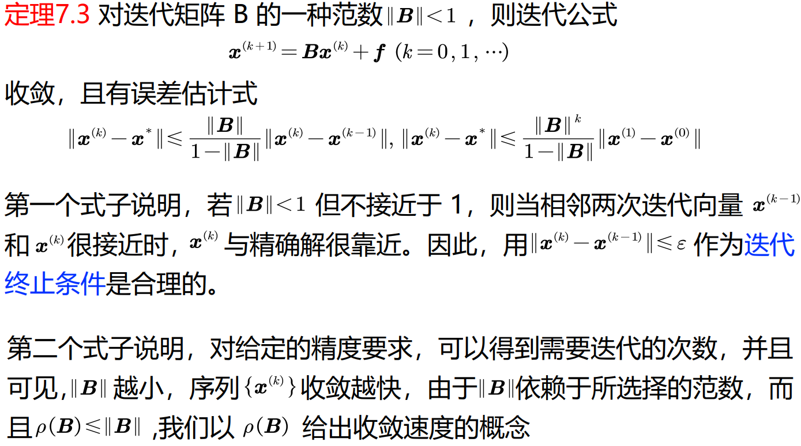
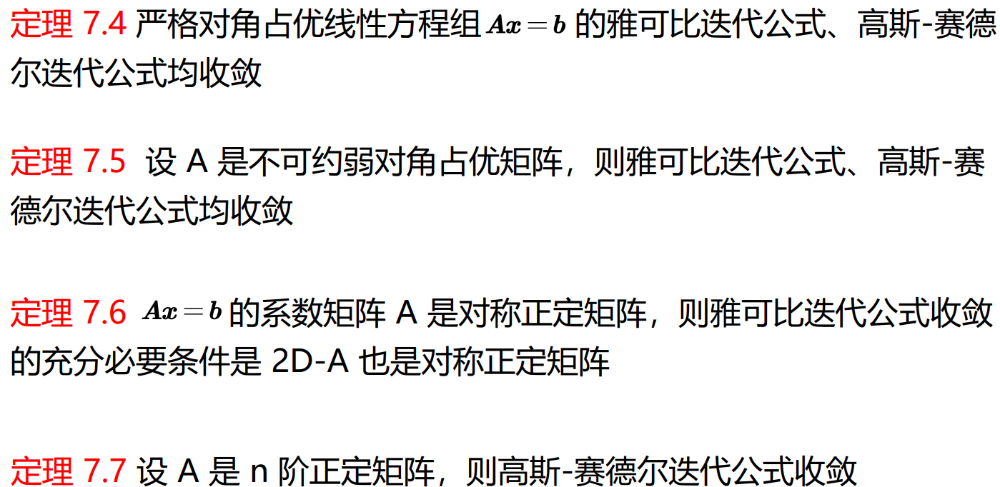
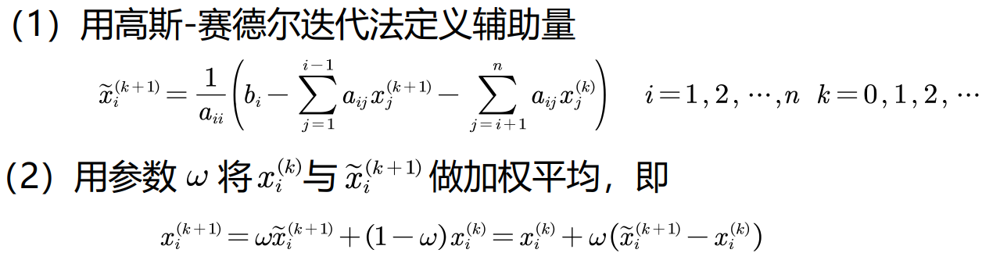

对于任何一个线性方程组

$$
\vec x=B\vec x+\vec c,
$$

由迭代法产生的向量序列$\{\vec x^{(k)}\}$是否一定逐步逼近此方程的精确解?

**不一定**.

适合解大型稀疏线性方程组

General form

$$
\vec x_{k+1}=\vec F(\vec x_k,\vec x_{k-1},\cdots,\vec x_0).
$$

If $\vec F$ only utilises $\vec x_k$, then it is called **single step iterative method**.

If $\vec F$ is linear, then it is called **linear iterative method**.

# 定常的线性迭代公式

Let error be $\varepsilon^{(k)}$.

Note that 

$$
\varepsilon^{(k)}=B^k\varepsilon^{(0)}.
$$

To Convergence Part.

## Jacobi Method

each equation: one in left side, others right side.

**Matrix Representation**

$$
\begin{aligned}
\vec x'&=D^{-1}(L+U)\vec x+D^{-1}\vec b\\
\ \\
&=(I-D^{-1}A)\vec x+D^{-1}\vec b,
\end{aligned}
$$

where

$$
\begin{aligned}
A:&=D-L-U\\
\ \\
L:&=-\text{lower triangular part of }A.\\
\ \\
U:&=-\text{upper triangular part of }A.\\
\ \\
D:&=\text{diagonal part of }A.
\end{aligned}
$$

## Gauss-Seidel

When you get the new value, use it immerdiately in the current iteration.

初始条件相同，高斯-赛德尔迭代法比雅可比迭代法收敛较快（即取相同初始值达到相同精度所需迭代次数较少），但这结论只当 A 满足一定条件时才是对的

**matrix representation**

$$
\vec x'=(D-L)^{-1}U\vec x+(D-L)^{-1}\vec b.
$$

## Convergence

$$
\begin{aligned}
&\forall \vec x^{(0)}(\vec x^{(k+1)}=B\vec x^{(k)}+\vec c\text{ converges}).\\
\ \\
\iff
&\lim_{k\to\infty}B^k=0\text{ matrix}.\\
\ \\
\iff&\rho(B)<1.
\end{aligned}
$$

$$
R(B):=-\ln\rho(B)
$$

as the asympototic convergent speed of the iteration equation.

## 超松弛迭代法的构造

使用迭代法的困难在于难以估计其计算量，有时候迭代过程虽然收敛，但由于收敛速度缓慢，使计算量变得很大而失去使用价值，因此迭代过程的加速具有重要意义。

逐次超松弛迭代（Successive Over-Relaxation），简称SOR方法，可以看作是带参数的高斯-赛德尔迭代法，实质上是高斯-赛德尔迭代的一种加速方法。

超松弛迭代法目的是提高迭代法的收敛速度，在高斯-赛德尔迭代公式的基础上作一些修改。这种方法是将前一步的结果 $\vec x^{(k)}$ 与高斯-赛德尔迭代方法的迭代值 $\tilde{\vec x}^{(k+1)}$ 适当加权平均，expect获得更好的近似值。

是解大型稀疏矩阵方程组的有效方法之一，有着广泛的应用。

式中系数 $\omega$ 称为松弛因子，当 $\omega=1$ 时，就是高斯-赛德尔迭代法。为了保证迭代过程收敛，要求 $\omega\in(0,2)$ 。当 $\omega\in(0,1)$ 时为低松弛法，当 $\omega\in(1,2)$ 时为超松弛法。但通常统称为超松弛法（SOR）

---

**Matrix Representation**

$$
B:=(D-\omega L)^{-1}((1-\omega)D+\omega U).
$$

$$
f:=\omega(D-\omega L)^{-1}\vec b.
$$

如果 A 为对称正定矩阵，且 $\omega\in(0,2)$ ，则解方程组 $A\vec x=\vec b$ 的SOR法收敛
