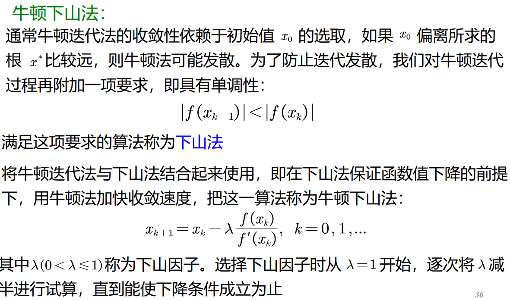
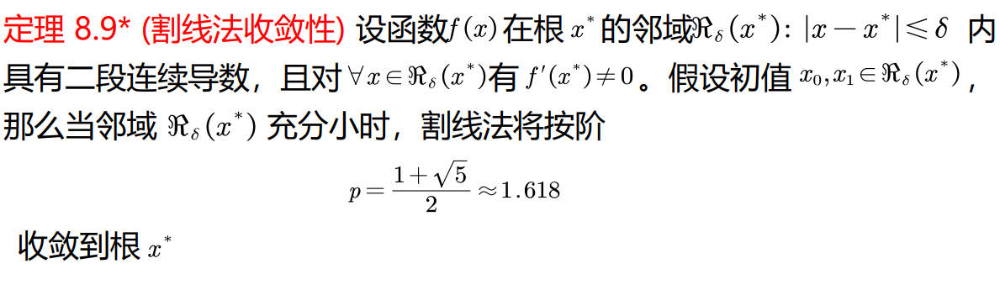

通常方程根的数值解法大致分为三个步骤进行：

1. 判断根的存在性，即方程有没有根？如果有根，有几个根？

2. 确定根的分布范围，即将每个根用区间隔离开来，这个过程实际上是获得方程各根的初始近似值

3. 根的精确化，将根的初始近似值按某种方法逐步精确化，直到满足预先要求的精度为止

# 二分法

优点：

1. 算法简单，在有限的区间内，收敛性总能得到保证

缺点：

1. 收敛速度不快，仅与公比为$\frac12$的等比级数的收敛速度相同，即是线性收敛的
2. 不能用于求偶重根、复根；不能推广到多元方程组求解
3. 不能求出所有根，有可能漏根

# 不动点迭代法

Consider the equation $f(x) = 0$ and the equivalent equation $x = g(x)$. The fixed point iteration method is to start with an initial guess $x_0$ and then iterate the equation $x_{n+1} = g(x_n)$ until the solution converges.

把$f(x)$转换成等价形式$x=g(x)$的方法很多，迭代函数的不同选择对应不同的迭代法，它们的收敛性可能有很大的差异。当方程有多个解时，
同一迭代法的不同初值，也可能收敛到不同的根。举例说明如下。

$$
f(x):=x^3-x-1=0.\\
\ \\
\varphi_1(x)=\sqrt[3]{1+x}.\\
\ \\
\varphi_2(x)=x^3-1.\\
$$
如果迭代函数在区间上具有压缩的性质，则迭代法收敛，否则发散

compress property

$$
\left|\frac{g(x)-g(y)}{x-y}\right|\leq L< 1.
$$
namely Lipschitz constant < 1.

denoted as $C(g)=1$.

Note that

$$
g'(x)<1\implies C(g)=1.
$$

**Thm1**

*Condition*

1. $\forall x\in[a,b](g(x)\in[a,b]).$

2. $C(g)=1$.

*Conclusion*

1. There is an **attractive** stationery point $x^*$.

before-study error:

$$
|x_{k}-x^*|\le \frac 1{1-L}|x_{k+1}-x_k|
$$

after-study error:

$$
|x_{k}-x^*|\le \frac {L^k}{1-L}|x_{1}-x_0|
$$

## p-order convergence

Suppose $\{x_k\}\to x^*, e_k:=|x_k-x^*|$.

If $\exist p\geq1,|c|\leq1(\lim_{k\to\infty}e_{k+1}/e_k^p=c)$ We call this $p$-order convergent.

**Theorem**

*Condition*

1. First $p$-order derivative at $x^*=0$.

2. $\varphi^{(p)}(x^*)\ne 0.$

*Conclusion*

1. $\{x_k\}$ is $p$-order convergent.

2. $$\lim_{k\to\infty}\frac{e_{k+1}}{e_k^p}=\frac{\varphi^{(p)}(x^*)}{p!}.$$

*Proof*

Taylor expansion.

## Steffensen迭代法

对于线性收敛的迭代法，收敛速度很慢，需要在此基础上考虑加速收敛的方法，设 $\{x_k\}$ 线性收敛到 $x^*$，则迭代误差 $e_k = x_k - x^*$ 满足

$$
\lim_{k \to \infty} \frac{e_{k+2}}{e_{k+1}} = \lim_{k \to \infty} \frac{e_{k+1}}{e_k} = c \ne 0
$$

因此当 $k$ 充分大时有：

$$
\frac{e_{k+2}}{e_{k+1}} \approx \frac{e_{k+1}}{e_k}
$$

即：

$$
\frac{x_{k+2} - x^*}{x_{k+1} - x^*} \approx \frac{x_{k+1} - x^*}{x_k - x^*}
$$

从中解出 $x^*$ 得：

$$
x^* \approx x_k - \frac{\left( x_{k+1} - x_k \right)^2}{x_{k+2} - 2x_{k+1} + x_k} 
\implies 
x_{k+1} = x_k - \frac{\left( \tilde x_{k+1} - x_k \right)^2}{\tilde x_{k+2} - 2\tilde x_{k+1} + x_k}
$$

也可以写成不动点迭代形式

$$
x_{k+1} = \Psi(x_k), \quad k = 0, 1, \cdots
$$

其中的迭代函数为

$$
\Psi(x) = x - \frac{\left[ \varphi(x) - x \right]^2}{\varphi(\varphi(x)) - 2\varphi(x) + x} = \frac{x \varphi(\varphi(x)) - \varphi^2(x)}{\varphi(\varphi(x)) - 2\varphi(x) + x}
$$

**steffensen迭代法收敛的充要条件**

**定理 8.5** 设函数 $\varphi(x) \in C_\Delta^1$，$\Delta = [x^* - \delta, x^* + \delta]$，$\delta$ 为足够小的正数，且 $\varphi'(x^*) \ne 1$，则 $x^*$ 是 $x = \Psi(x)$ 的不动点的充要条件是 $x^* = \varphi(x^*)$

P.S. if $\varphi\in C_\Delta^2$, $\Psi$ is least 2-order locally convergent.

# Newton Method

用迭代法可逐步精确方程$f(x)=0$根的近似值，但必须要找到等价方程$x=\varphi(x)$，如果$\varphi(x)$选得不合适，不仅影响收敛速度，而且有可能造成迭代公式发散。

能否找到一种迭代方法，既结构简单，收敛速度快，又不存在发散的问题? 这就是本节要介绍的牛顿迭代法。

牛顿迭代法的基本思想：
对于方程$f(x)$，如果$f$是线性函数，则它的求根是容易的。牛顿method的基本思想是**将非线性函数逐步线性化，从而将it近似地转化为线性方程求解**。

$x_{k+1}$为函数$f$在点$x_k$处的切线与横坐标轴的交点，因此牛顿迭代法也称为切线法

Sufficient condition for convergence:

1. $f(a)f(b)<0$.

2. $f'(x)\ne 0,f''(x)$ doesn't change sign.

3. $f(x_0)f''(x_0)>0$.

Under this condition, it is 2-order convergent. and $c=\frac 12 f''(x^*)/f'(x^*)$.

为了改善重根时 Newton 法的收敛性，

let

$$
\varphi(x) = x - m\frac{f(x)}{f'(x)}
$$

---
No exam requirement.

可以利用已求函数值$f(x_k),f(x_{k-1}),\cdots$来回避导数值$f'(x_k)$的计算，导出这种方法的基本原理is插值法

porabola method: refer to ppt 19
