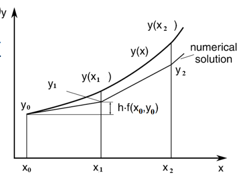
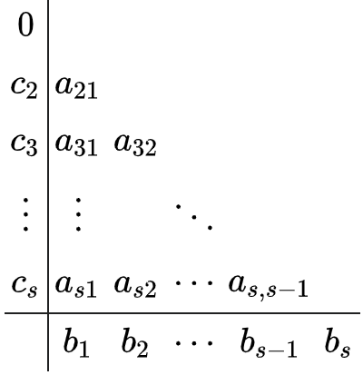

考虑一阶常微分方程初值问题：

$$
\begin{cases}
y' = f(x, y). \\
\ \\
y(x_0) = y_0.
\end{cases}
$$

设 $f(x, y)$ 是连续函数，对 $y$ 满足 Lipschitz 条件，即存在 $L > 0$，使得对于任意 $y_1, y_2 \in \mathbb{R}$ 有 $|f(x, y_1) - f(x, y_2)| \le L|y_1 - y_2|$，这样初值问题的解是存在唯一的.

所谓数值解法，就是寻找解 $y(x)$ 在一系列离散点

$$
a = x_0 < x_1 < x_2 < \cdots < x_n = b
$$

上的近似值 $y_0, y_1, y_2, \cdots, y_n$。相邻两个节点的间距 $h_k = x_k - x_{k-1} (k = 1, 2, \cdots, n)$ 称为步长。常用等步长 $h = \frac{b - a}{n}$， 这时节点为 $x_k = a + kh (k = 0, 1, \cdots, n)$

注：准确值为 $y(x)$, $y_k$ 为 $y(x_k)$ 的近似值，记 $f(x_k, y_k) = f_k$

# Euler Method

欧拉方法是最简单的数值解法.

基本思想是用切线逼近曲线，即 $y_{k+1}\approx y_k + h f_k$.

This is called the **explicit Euler method**.

The **implicit Euler method** is to use $y_{k+1} = y_k + h f_{k+1}$, whose right-hand side is evaluated at the new point.

隐式方程通常用**迭代法**求解，迭代过程的实质是逐步显式化 (if the $y$ exists as a linear term, just solve it out!)

$$
y_{n+1}^{(k+1)} = y_n + h f(x_{n+1}, y_{n+1}^{(k)}), \quad k = 0, 1, \cdots
$$

由于 $f(x, y)$ 对 $y$ 满足李普希兹条件 $|f(x, y_1) - f(x, y_2)| \le L |y_1 - y_2|$，将上述减去 $y_{k+1} = y_k + h f_{k+1}$ 得

$$
\left| y_{n+1}^{(k+1)} - y_{n+1} \right| = h \left| f(x_{n+1}, y_{n+1}^{(k)}) - f(x_{n+1}, y_{n+1}) \right| \le hL \left| y_{n+1}^{(k)} - y_{n+1} \right|
$$

由此可知，只要 $hL < 1$ 迭代法就收敛到解 $y_{n+1}$.

Trapezoid method uses the arithmetic average of the two methods.

## 两步欧拉公式

$$
y' = f(x, y)
$$

将上述两端从 $x_{n-1}$ 到 $x_{n+1}$ 积分，并用中矩形公式计算积分项，得

$$
y(x_{n+1}) - y(x_{n-1}) = \int_{x_{n-1}}^{x_{n+1}} f(x, y(x)) \, dx \approx \int_{x_{n-1}}^{x_{n+1}} f(x_n, y_n) \, dx = 2h f(x_n, y_n)
$$

即

$$
y_{n+1} = y_{n-1} + 2h f(x_n, y_n)
$$

## Improved Euler Method

$$
\begin{aligned}
&\text{Guess: }\tilde y_{n+1} = y_n + hf(x_n,y_n)\\
\ \\
&\text{Correct: }y_{n+1} = y_n + \frac{h}{2}(f(x_n,y_n) + f(x_{n+1},\tilde y_{n+1}))\\
\end{aligned}
$$

而这样建立的预测-校正系统通常称为改进的欧拉公式

## 单步法

单步法可以写成如下统一形式

$$
y_{n+1} = y_n + h \phi(x_n, x_{n+1}, y_n, y_{n+1}, h).
$$

If the argument of $\phi$ is $x_n, y_n, x_{n+1}$, then it is **explicit**; otherwise, it is **implicit**.

Actually $\phi$ represents a way to approximate the 1-order derivative in this interval.

# Error

假设 $x_n$ 处的 $y_n$ 没有误差，即 $y(x_n)=y_n$ ，考虑从 $x_n$ 到 $x_{n+1}$ 这一步的误差，这就是**局部误差**的概念

$$
\begin{aligned}
T_{n+1}:&=y(x_{n+1})-y_{n+1}\\
\ \\
&=y(x_{n+1})-y(x_n)-h\phi(x_n,x_{n+1},y(x_n),y(x_{n+1}),h).
\end{aligned}
$$

if

$$
T_{n+1}=O(h^{p+1}),p\in\mathbb Z.
$$

then the method is of order $p$.

Furthermore if

$$
T_{n+1}=g(x_n,y(x_n))h^{p+1} +O(h^{p+2}),p\in\mathbb Z.
$$

Then $g\cdot h^{p+1}$ is called the **main term** of the local error.

# Runge-Kutta Method

基本思想:

我们用区间上若干个点的导数，而不是高阶导数(computationally expensive)，将它们作线性组合得到平均斜率，将其与解的 Taylor 展开相比较，使前面若干项吻合，从而得到具有一定阶的方法。

We still adopt the form of

$$
y_{n+1}=y_n+h\cdot\phi.
$$

But now $\phi$ is a linearly weighted combination of some easy approximation of derivatives.

$$
\phi:=\sum_{i=1}^L\lambda_iK_i,\\
\ \\
K_i:=f(x_n+c_ih,y_n+c_ih\sum_{j=1}^{i-1}a_{i,j}K_j).
$$

So $K_i$ wants to approximate $y'(x_n+c_ih)$ by first approximate $y(x_n+c_ih)$ by $y_n+c_ih\sum_{j=1}^{i-1}a_{i,j} K_j$ which is another linearly weighted combination of former approximation.

Here we require that

$$
c_1=0,\forall i(c_i\leq1\land\sum_{j=1}^{i-1}a_{i,j}=1),\sum_{i=1}^L\lambda_i=1.
$$

And its error is

$$
T_{n+1}=y(x_{n+1})-y(x_n)-h\sum_{i=1}^L\lambda_iK_i^*.
$$

$K^*$ here is to substitute $y_n$ with $y(x_n)$ (accurate solution).

To determine all the parameters, Taylor expand $y$ at $x_n$ and all $K^*$ at $(x_n, y(x_n))$.

The method family obtained in this way is called the $L$-stage $p$-order RK method.

These data are usually arranged in a mnemonic device, known as a *Butcher tableau.*

Here $b$ is $\lambda$.

You can see that explicit Euler, improved Euler and Heun formula are all special case of RK method.

# Linear Multistep Method

Refer to PPT 10.4. No requirement in exam.
