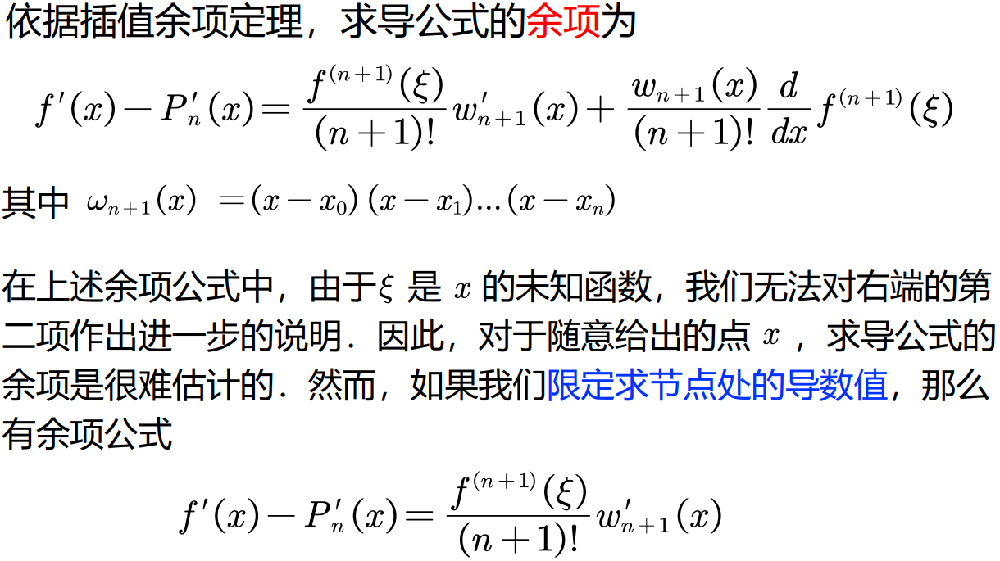
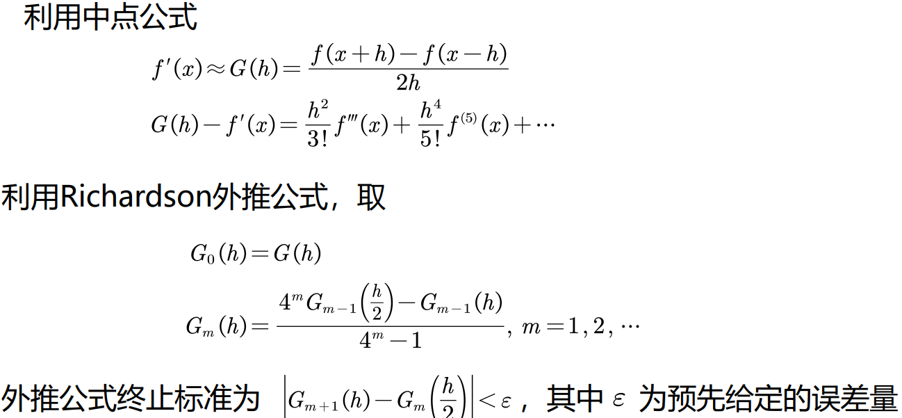

数值微分就是用函数值的线性组合近似出函数在某点的导数值，按照Taylor展开原理可得几种数值微分公式.

$$
f'(x)=\frac{f(x+h)-f(x)}{h}+\Omicron(h).\\
\ \\
f'(x)=\frac{f(x)-f(x-h)}{h}+\Omicron(h).\\
\ \\

f'(x)=\frac{f(x+h)-f(x-h)}{2h}+\Omicron(h^2).\\
$$

其中h为一增量，称为步长，最后一种方法称为中点法，它是前两种方法的算术平均，但是它的误差阶却由$\Omicron(h)$提高到$\Omicron(h^2)$

从截断误差角度来看，步长越小，计算结果越准确

考虑舍入误差，当h很小时，因$f(x+h)$与$f(x-h)$很接近，直接相减会造成有效数字的严重损失，因此从舍入误差角度来看步长不宜太小

# 插值型求导公式

First use an interpolation formula to approximate the original function. Then use the derivative of the polynomial to approximate the derivative.

应当指出，即使$f(x)$与$P(x)$的值相差不多，导数的近似值$P'(x)$与导数值$f'(x)$仍然可能相差很大．因而在使用以上求导公式时，应注意进行误差分析.

# 三次样条函数求导*

No test requirement.

# 外推

# Summary

